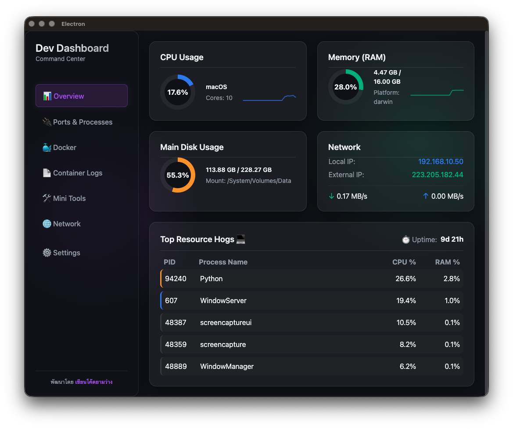

<div align="center">
  
  <h1>🚀 Dev Dashboard - Command Center</h1>
  <p>สุดยอดศูนย์รวมเครื่องมือและ Dashboard สำหรับนักพัฒนา (Developer) สร้างด้วย Electron, Vite, React, และ TypeScript</p>
</div>

---

## 🌟 ฟีเจอร์หลัก (Features)

Dev Dashboard ถูกสร้างขึ้นเพื่อให้นักพัฒนามีเครื่องมือที่จำเป็นทั้งหมดอยู่ในหน้าต่างเดียว โดยมีฟีเจอร์หลักต่างๆ ดังนี้:

- **📊 1. Overview (ภาพรวมระบบ)**
  - ติดตามสถานะการทำงานของเครื่องแบบเรียลไทม์ (CPU, RAM, อุณหภูมิ, ฯลฯ)
- **🔌 2. Ports & Processes (จัดการโปรเซสและพอร์ต)**
  - ดูและช่วยปิด (Kill) โปรเซสที่กินทรัพยากรหรือพอร์ตที่ค้างอยู่ได้อย่างง่ายดาย
- **🐳 3. Docker Management**
  - จัดการคอนเทนเนอร์ (Start, Stop, Restart) และดูสถานะของ Docker ได้ครบจบในที่เดียว
- **📄 4. Container Logs**
  - ดู Log ของ Docker Container แบบเรียลไทม์
- **🛠️ 5. Mini Tools**
  - เครื่องมือเสริมขนาดเล็กจิ๋วสำหรับช่วยงานพัฒนาทั่วไป
- **🧰 6. Utility & Mock Data**
  - เครื่องมือสำหรับสร้าง Dummy Data, การคำนวณค่า Hash, สร้าง UUID/Password, และทดสอบ Cron expressions
- **🌐 7. Network**
  - ตรวจสอบสถานะการเชื่อมต่อ และทดสอบ Ping แบบง่าย
- **⚡ 8. API Tester**
  - ตัวทดสอบ API ในตัว (คล้าย Postman المصغرة) รองรับ GET, POST, PUT, DELETE ฯลฯ พร้อมดูเวลา HTTP Response และ Format JSON อัตโนมัติ

## 🎨 การปรับแต่ง UI (Customization)

หน้า **Settings (การตั้งค่า)** ของแอปมาพร้อมกับระบบ Themes และ Preferences:
- **☀️/🌙 Color Scheme Toggle**: สามารถสลับระหว่างโหมด Light Mode และ Dark Mode ได้อย่างอิสระ
- **🌈 Accent Theme Colors**: เลือกสีสไตล์ตัวหนังสือและปุ่มได้ เช่น Blue, Cyber Purple, Matrix Green, Sunset Orange หรือ Synthwave Pink
- **📏 Typography Control**: ปรับเปลี่ยน Font ขนาดเล็ก-ใหญ่ และสลับ Font Family ได้ตลอดเวลา (รวมถึง `Fira Code`)

## 🛠️ เทคโนโลยีที่ใช้ (Tech Stack)

- **[Electron](https://www.electronjs.org/)**: สำหรับการสร้าง Cross-Platform Desktop App
- **[React 19](https://react.dev/)**: เฟรมเวิร์กจัดการ UI
- **[TypeScript](https://www.typescriptlang.org/)**: เพื่อความปลอดภัยและการเช็ค Typed ขั้นสูงในการพัฒนา
- **[Vite](https://vitejs.dev/)**: ระบบ Build Tool ที่ทำงานได้รวดเร็วทันใจ ผ่าน `electron-vite`
- **[Systeminformation](https://systeminformation.io/)**: ดึงข้อมูล Hardware และ Server
- **[Lucide React](https://lucide.dev/)**: ไอคอนที่สวยงามคมชัด เรียบหรู

## 🚀 วิธีการติดตั้งและรันโปรแกรม (Getting Started)

### ข้อกำหนดเบื้องต้น (Prerequisites)
- [Node.js](https://nodejs.org/) (แนะนำเวอร์ชัน 18 ขึ้นไป)
- แนะนำให้ติดตั้ง [Docker](https://www.docker.com/) กรณีต้องการใช้ฟีเจอร์ Docker Manager

### การรันในโหมดกฝพัฒนา (Development)

1. **โคลนโปรเจกต์ (Clone the repository)**
   ```bash
   git clone https://github.com/warchag/Dev-Dashboard
   cd "Dev Dashboard"
   ```

2. **ติดตั้ง Dependency**
   ```bash
   npm install
   ```

3. **รันเซิร์ฟเวอร์ด้วยโหมดนักพัฒนา**
   ```bash
   npm run dev
   ```

## 📦 วิธีการ Build แอปให้เป็นไฟล์ (Packaging)

คุณสามารถ Build โปรแกรมสำหรับ OS ต่างๆ ได้โดยใช้คำสั่งด้านล่าง:

- สำหรับ **macOS** (.dmg):
  ```bash
  npm run build:mac
  ```
- สำหรับ **Windows** (.exe):
  ```bash
  npm run build:win
  ```
- สำหรับ **Linux** (.AppImage / .deb):
  ```bash
  npm run build:linux
  ```

---
**พัฒนาโดย** [**เขียนโค้ดยามว่าง**](https://www.facebook.com/learntodeveloper) ☕ 
*เรียนรู้ สร้างสรรค์ และแบ่งปัน*
